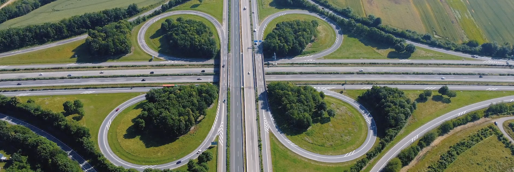

# Vehicle detection



This is a test project. It shows how I plan and carry out the work with data for an object detector: from raw drone video to a labeled dataset, then training and measurement. The focus is on the dataset: every step is documented and can be repeated with the scripts in this repository.

The work follows four stages:

1. [**Plan**](#1-plan): what data is needed, where it comes from, how it is split.
2. [**Label**](#2-label): pre-labeling with pretrained models, manual correction in CVAT.
3. [**Train**](#3-train): TODO.
4. [**Measure**](#4-measure): TODO.

📄 How to annotate (labeling rules and examples): [**Annotation Guidelines** (Notion)](https://app.notion.com/p/Annotation-Guidelines-3eb4e4b0f1dc802bb1bdec5d2e8f53e2)

## Pipeline

Requirements: **Python 3.10+**, **Docker Desktop** (for CVAT), **FFmpeg** (for frame extraction). Install Python dependencies once:

```bash
pip install -r requirements.txt
```

All commands are run from the project root.

| Step                             | Command / action                                                                                                   | Output                                                            |
| -------------------------------- | ------------------------------------------------------------------------------------------------------------------ | ----------------------------------------------------------------- |
| 1. Extract frames                | `bash scripts/extract_frames.sh` (fps=3, see [Frame extraction](#frame-extraction))                                | `data/frames/<set>/`                                              |
| 2. Pre-label with Grounding DINO | `python3 scripts/auto_label_dino.py --role all`                                                                    | `data/gdino/labels/<set>/`, `data/gdino/cvat_zip/<set>_gdino.zip` |
| 3. Correct in CVAT               | import `<set>_gdino.zip`, fix boxes by the [rules](https://app.notion.com/p/Annotation-Guidelines-3eb4e4b0f1dc802bb1bdec5d2e8f53e2), export YOLO 1.1 ([CVAT workflow](#cvat-workflow)) | `data/cvat_export/<set>.zip`                                      |
| 4. Collect final labels          | `python3 scripts/import_cvat_export.py --role all`                                                                 | `data/annotations/<set>/`                                         |
| 5. Train                         | TODO                                                                                                               |                                                                   |
| 6. Measure                       | TODO                                                                                                               |                                                                   |

## Task

Detect vehicles in drone footage taken at altitude. One class: `vehicle`.

## 1. Plan

### Data sources

Public videos from Pexels. The training clips were picked to cover different scenes (interchange, rural road, top-down highway, city intersection), so the model does not learn only one type of road. The eval clip is a separate video.

| Set     | Scene                        | Source                                                              |
| ------- | ---------------------------- | ------------------------------------------------------------------- |
| train_a | Highway interchange          | [pexels.com/video/8968356](https://www.pexels.com/video/8968356/)   |
| train_b | Rural highway, light traffic | [pexels.com/video/5382494](https://www.pexels.com/video/5382494/)   |
| train_c | Simple highway, top-down     | [pexels.com/video/8457857](https://www.pexels.com/video/8457857/)   |
| train_d | Urban intersection           | [pexels.com/video/3405804](https://www.pexels.com/video/3405804/)   |
| eval    | City highway, daytime        | [pexels.com/video/32179597](https://www.pexels.com/video/32179597/) |

### Split

- **Train:** `train_a`, `train_b`, `train_c`, `train_d`.
- **Eval:** a separate clip, not frames from the training clips. Neighbouring frames of one video are almost identical, so a random frame split would leak into the test. The eval clip is kept out of every decision (model choice, thresholds, labeling rules) until the final measurement.

### Frame extraction

Frames are already in the repository (`data/frames/<set>/`); this section documents how they were produced.

Each video was downloaded from its source link into `data/raw_videos/<set>/` and split into frames with **FFmpeg** ([ffmpeg.org](https://ffmpeg.org)) at **3 frames per second** (`fps=3`), the same value for all sets.

The script [scripts/extract_frames.sh](scripts/extract_frames.sh) runs this for every set:

```bash
bash scripts/extract_frames.sh
bash scripts/extract_frames.sh train_a
```

For one video it runs:

```bash
ffmpeg -i data/raw_videos/train_a/<video>.mp4 -vf fps=3 data/frames/train_a/frame_%04d.jpg
```

Frames are named `frame_0001.jpg`, `frame_0002.jpg`, ...; each label file later uses the same name (`frame_0001.txt`).

### What the data looks like

All frames are `.jpg`, shot from a drone at altitude. Vehicles are very small (a typical box is about 3% of frame width).

| Set       | Frames  |
| --------- | ------- |
| train_a   | 58      |
| train_b   | 94      |
| train_c   | 51      |
| train_d   | 73      |
| **Total** | **276** |
| eval      | TODO    |

### Project layout

Shared data (frames) is kept once; everything produced by a model lives in that model's own folder.

| Path                         | Content                                         |
| ---------------------------- | ----------------------------------------------- |
| `data/raw_videos/<set>/`     | Source videos                                   |
| `data/frames/<set>/`         | Extracted frames (shared by both models)        |
| `data/yolo/labels/<set>/`    | Pre-labels from YOLOv8n (YOLO txt)              |
| `data/yolo/cvat_zip/`        | CVAT import archives `<set>_yolo.zip`           |
| `data/gdino/labels/<set>/`   | Pre-labels from Grounding DINO (YOLO txt)       |
| `data/gdino/cvat_zip/`       | CVAT import archives `<set>_gdino.zip`          |
| `data/cvat_export/<set>.zip` | Export from CVAT after manual review (YOLO 1.1) |
| `data/annotations/<set>/`    | Final labels after manual review in CVAT        |
| `scripts/`                   | Frame extraction, pre-labeling, CVAT import     |
| `docs/images/`               | Images for the README                           |

---

## 2. Label

Labels are not drawn from scratch. Frames are first pre-labeled by pretrained models, then every frame is reviewed and corrected by hand in **CVAT**.

- **How to annotate** (what counts as a vehicle, how to draw a box, examples, quality check): 📄 [**Annotation Guidelines** (Notion)](https://app.notion.com/p/Annotation-Guidelines-3eb4e4b0f1dc802bb1bdec5d2e8f53e2).
- **Tool setup and CVAT steps**: below in this README.

### CVAT setup

Labeling is done in [CVAT](https://github.com/cvat-ai/cvat), run locally in Docker. It supports YOLO import/export, so pre-labels from the models can be loaded and corrected instead of drawing every box from scratch.

```bash
git clone https://github.com/cvat-ai/cvat ~/cvat
cd ~/cvat
docker compose up -d
docker compose ps                  # all containers should be "Up"
docker exec -it cvat_server bash -ic 'python3 ~/manage.py createsuperuser'
```

Open <http://localhost:8080> and log in with the created account.

- CVAT needs several GB of RAM. If it reports `Required services are not healthy`, raise Docker Desktop memory (Settings > Resources) to 6-8 GB and restart.
- Annotations live in Docker volumes. Stop with `docker compose down`; never add `-v`, it deletes all tasks and annotations.

### Pre-labeling

Two pretrained models were tried, inference only (no fine-tuning), with general weights (COCO / open-vocabulary), not aerial datasets.

```bash
python3 scripts/auto_label.py                   # YOLOv8n, all sets, conf=0.25
python3 scripts/auto_label_dino.py --role all   # Grounding DINO tiny, all sets
```

Each script writes one YOLO `.txt` per frame (`0 x_center y_center width height`, normalized) into `data/<model>/labels/<set>/` and builds a CVAT import archive in `data/<model>/cvat_zip/`. Weights download on first run (`yolov8n.pt`; `IDEA-Research/grounding-dino-tiny`, about 700 MB).

### Pre-labeling comparison (train_a, 58 frames)

| Model               | Boxes | Avg per frame |
| ------------------- | ----- | ------------- |
| YOLOv8n (COCO)      | 56    | ~1            |
| Grounding DINO tiny | 1608  | ~28           |

- YOLOv8n misses most vehicles: the input is downscaled and vehicles are only a few pixels wide. Example: `frame_0032` has one box but dozens of visible vehicles.
- Grounding DINO finds about 28x more boxes. More boxes does not mean better: some are likely false positives (shadows, road markings). A sampled precision check is **TODO**.
- **Decision: Grounding DINO pre-labels are the starting point for manual correction in CVAT.** YOLOv8n misses almost all vehicles, so correcting it would mean drawing nearly every box by hand. With Grounding DINO most vehicles are already boxed, and removing false positives is faster than adding missed boxes. The decision is based on training data only.

### Grounding DINO on all training sets

| Set       | Frames  | Boxes    | Avg per frame | Run time (CPU) |
| --------- | ------- | -------- | ------------- | -------------- |
| train_a   | 58      | 1608     | ~28           | ~5 min         |
| train_b   | 94      | 806      | ~8.6          | ~15 min        |
| train_c   | 51      | 1513     | ~29.7         | ~10 min        |
| train_d   | 73      | 2177     | ~29.8         | ~15 min        |
| **Total** | **276** | **6104** | ~22           |                |

- Run times are approximate (wall clock, noted by hand).
- train_b (rural highway, light traffic) gives far fewer boxes per frame, which matches its sparse traffic.

### CVAT workflow

Each set (`train_a` ... `train_d`) is a separate CVAT task.

1. **Create the task:** Tasks > `+` > Create a new task.
   - Name: the set name, e.g. `train_a`.
   - Labels: add `vehicle`, type Rectangle. Required, otherwise import fails with `Label 'vehicle' is not registered for this task`.
   - My computer: select all `.jpg` from `data/frames/<set>/`. The count must match the set (58 / 94 / 51 / 73).
   - Advanced configuration: sorting method **Natural**, image quality **95** (vehicles are tiny).
2. **Import pre-labels:** Actions > Upload annotations > **YOLO 1.1** > mode Replace > `data/gdino/cvat_zip/<set>_gdino.zip`. If the zip is missing, build it: `python3 scripts/make_cvat_zip.py --role all --source gdino`. Check that the box count in Info matches the source (train_a: 1608).
3. **Correct:** go frame by frame following the [Annotation Guidelines](https://app.notion.com/p/Annotation-Guidelines-3eb4e4b0f1dc802bb1bdec5d2e8f53e2). Save often (Ctrl+S).
4. **Export:** Actions > Export task dataset > **YOLO 1.1**, Save images off. Download the zip from the Requests tab, rename it to `<set>.zip` and put it into `data/cvat_export/`.
5. **Collect final labels:**

   ```bash
   python3 scripts/import_cvat_export.py --role train_a   # or --role all
   ```

   The script copies the labels to `data/annotations/<set>/`, writes an empty `.txt` for frames without vehicles, checks that the archive belongs to this set and that only class `0` is used, and prints the box count.

Label format (YOLO): one line per box, `0 x_center y_center width height`, normalized to 0-1; the `.txt` has the same name as its frame.

### Labeling status

---

## 3. Train

**TODO.**

---

## 4. Measure

**TODO.**
